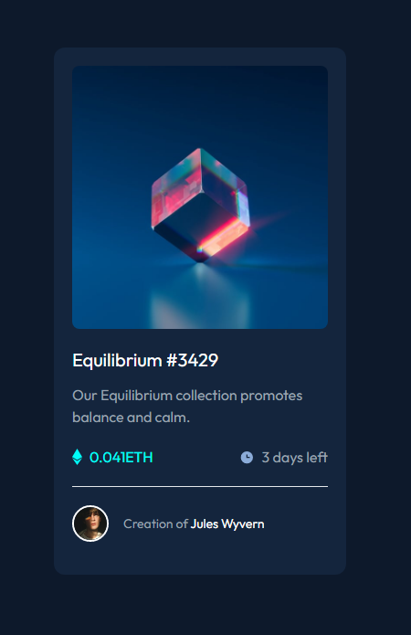

# Frontend Mentor - NFT preview card component solution

This is a solution to the [NFT preview card component challenge on Frontend Mentor](https://www.frontendmentor.io/challenges/nft-preview-card-component-SbdUL_w0U). 

## Table of contents

- [Overview](#overview)
  - [The challenge](#the-challenge)
  - [Screenshot](#screenshot)
  - [Links](#links)
  - [Built with](#built-with)
  - [What I learned](#what-i-learned)
## Overview
- This is a NFT preview card component which is responsive.

### The challenge

Since I have just started learning Tailwind CSS, installation part was a bit tough for me as it had three methods of installation.
- Using CDN
- Tailwind CLI
- PostCSS

I decided to go with CDN as it is less time consuming and I could quickly set up the project. 

However I found it less efficient as Tailwind Intellisense (VS Code extension which suggests different classes based on what we type) does not work. 
### Screenshot

### Links

- Solution URL: [Github](https://github.com/rk-codeflow/tw1-nft-preview-card)
- Live Site URL: [Netlify](https://nft-card-componentt.netlify.app/)

### Built with

I have started learning [Tailwind CSS](https://tailwindcss.com/) and the best way to learn anything is to build projects as much as we can. Tailwind has a lot of customization options. It is a utility based CSS framework.

- Built with Tailwind CSS
- Flexbox
- Responsive 

### What I learned
My learning from this first project which is build in Tailwind
- I learned how to install Tailwind in our project.
- It is better to install via Tailwind CLI, not via CDN - my understanding.
- Knew how to customize the tailwind config file like customizing colors, fonts etc.
- Understood handling different states like active, hover etc on Tailwind
- Though I had been using Netlify to host sites I was unaware that the live URL is updated automatically when we push our code on github. On searching methods how to     automatically update live URL, I came to know Netlify automatically updates this.